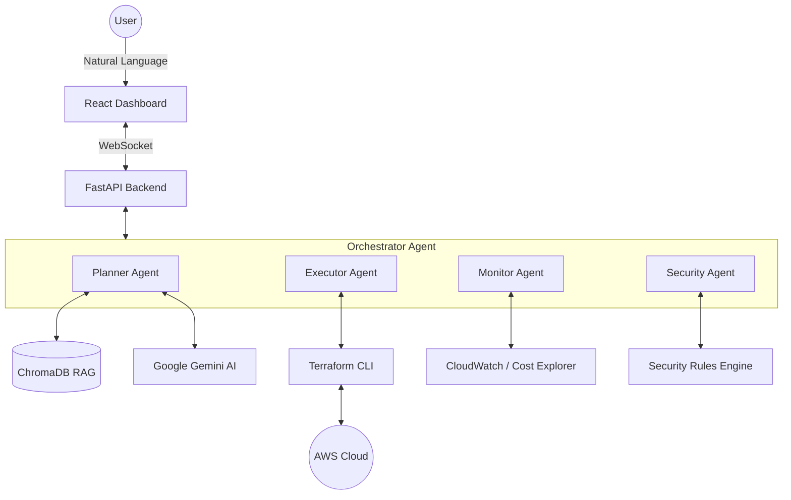

# InfraGenie — Multi-Agent Agentic AI for Autonomous AWS Infrastructure Management

> **Type what you want. Watch AI provision real cloud infrastructure.**

InfraGenie is a state-of-the-art AI-powered platform that transforms natural language requests into production-ready AWS infrastructure. Built with a sophisticated multi-agent architecture, it implements a Perceive-Reason-Plan-Act-Observe (PRPAO) loop to manage the entire infrastructure lifecycle with human-in-the-loop oversight.

---

## 🚀 Quick Demo

1.  **Plain English Request**: "Create an S3 bucket for assets and a DynamoDB table for metadata."
2.  **Agentic Workflow**: The Planner agent generates Terraform HCL, which is then scanned by a dedicated Security agent for vulnerabilities and policy compliance.
3.  **Real Provisioning**: Upon human approval in the real-time dashboard, the Executor agent applies the plan to your AWS account, streaming logs back to you live.

---

## ✨ Core Features

*   **5 Specialized Agents**: Orchestrator, Planner, Executor, Monitor, and Security agents working in concert.
*   **4-Tier Intelligence Router**: A sophisticated routing logic that chooses between hardcoded rules, RAG-enhanced reasoning, full Gemini analysis, or mandatory human gates.
*   **RAG Pipeline with ChromaDB**: Uses Retrieval-Augmented Generation to learn from every deployment and ground AI responses in AWS best practices.
*   **Real AWS Provisioning**: Native support for S3, SQS, DynamoDB, EC2, IAM, and more via Terraform.
*   **Human-in-the-Loop**: Critical actions always require manual approval via an intuitive UI modal.
*   **Autonomous Monitoring**: Continuous observation of your cloud environment with self-healing and anomaly detection capabilities.

---

## 🏗️ Architecture



---

## 🛠️ Technology Stack

*   **Backend**: Python FastAPI, Google Gemini API, ChromaDB (Vector Store), SQLAlchemy.
*   **Frontend**: React, Tailwind CSS, WebSockets (for live log streaming).
*   **Infrastructure**: Terraform, AWS (S3, DynamoDB, CloudWatch, SSM, Cost Explorer).
*   **Security**: tfsec, Checkov, Custom Security/Policy Rule Engines.

---

## 🏁 Getting Started

### Prerequisites
*   Python 3.11+
*   Node.js 18+
*   Terraform CLI
*   AWS Account & Google Gemini API Key

### Installation

1.  **Clone the repository**:
    ```bash
    git clone https://github.com/yourusername/infragenie.git
    cd infragenie
    ```

2.  **Configure Environment**:
    ```bash
    cp .env.example .env
    # Edit .env and fill in your AWS and Gemini credentials
    ```

3.  **Install Backend Dependencies**:
    ```bash
    pip install -r backend/requirements.txt
    ```

4.  **Start the Backend**:
    ```powershell
    # Windows
    $env:PYTHONPATH="backend"; python -m uvicorn backend.main:app --reload
    ```

5.  **Start the Frontend**:
    ```bash
    cd frontend
    npm install
    npm start
    ```

6.  **Visit**: [http://localhost:3000](http://localhost:3000)

---

## 🧠 How It Works

1.  **Request**: User types an infrastructure request in the chat (e.g., "Set up an SQS queue").
2.  **Perceive**: The **Orchestrator** perceives the current state and routes the request.
3.  **Retrieve**: The **Planner** uses RAG to retrieve similar past successful deployments from ChromaDB.
4.  **Plan**: **Gemini** generates validated Terraform HCL based on the intent and retrieved context.
5.  **Scan**: The **Security Agent** runs static analysis (tfsec/Checkov) to block dangerous configurations.
6.  **Approve**: The user reviews the plan and cost impact in the UI and clicks "Approve".
7.  **Act**: The **Executor** runs `terraform init` → `plan` → `apply`, streaming logs via WebSockets.
8.  **Observe**: The **Monitor Agent** continuously watches the new resources for drift or anomalies.

---

## ⚠️ Known Limitations (v1.0)

*   **Cost Explorer**: Requires manual AWS account-level activation (non-blocking).
*   **Audit Logs**: Currently logged to console. SQLite persistence is in active development.
*   **WebSocket**: Occasional reconnection events may occur; does not impact background deployments.
*   **Resource Monitoring**: S3 and EC2 are fully supported in the UI. DynamoDB and SQS visualization is coming soon.

---

## 📂 Project Structure

```text
infragenie/
├── backend/
│   ├── agents/          # 5 specialized AI agents
│   ├── rag/             # ChromaDB RAG pipeline & embeddings
│   ├── terraform/       # Terraform CLI wrappers & runners
│   ├── rules/           # Security & Policy rules engines
│   └── aws/             # AWS SDK (Boto3) integrations
├── frontend/            # React dashboard (Dashboard, Deploy, Monitor)
├── terraform_workspace/ # Directory for generated .tf files at runtime
└── chroma_db/           # Local persistence for the vector database
```

---

## 💡 Key Insights for Recruiters

*   **End-to-End Execution**: This is not just a code generator; it actually manages the full deployment and monitoring lifecycle on AWS.
*   **Hybrid Intelligence**: The 4-tier router knows when to use fast hardcoded rules and when to escalate to expensive LLM reasoning.
*   **Learning System**: The RAG pipeline ensures the system becomes more context-aware and reliable with every deployment.
*   **Security First**: Integrated security scanning blocks risky configurations (like open SSH or unencrypted buckets) before they ever hit the cloud.
*   **Resilient**: The system features self-correction logic that automatically retries failed Terraform applies with AI-driven fixes.

---

## 📺 Demo Video
[Watch the 90-second Demo showing S3 + DynamoDB deployment](https://your-video-link.com)

---

## 🗺️ Future Roadmap

*   **Multi-Cloud Support**: Expanding to Google Cloud Platform (GCP) and Azure.
*   **Advanced RBAC**: Granular user permissions and enterprise-grade audit trails.
*   **Cost Optimization**: Proactive AI suggestions for reducing AWS spend.
*   **Drift Remediation**: Automatic "reset to baseline" for unauthorized infrastructure changes.
*   **Agent Framework**: A plugin system for creating custom specialized agents.

---

## 🤝 Contributing

This is a portfolio project designed to showcase agentic AI and cloud automation. While not currently accepting PRs, feel free to open an issue for questions or suggestions.

---

## 📄 License

This project is licensed under the MIT License - see the [LICENSE](LICENSE) file for details.
